---

title: Git 完全入门指南：从安装到 VSCode 日常协作
published: 2026-04-09
description: 手把手教你安装 Git，并用 VSCode 的可视化操作轻松管理代码版本，再也不怕敲命令。
image: "./Git.png"
tags: ["教程", "Git", "VSCode"]
category: 教程
draft: false

---

> 封面图片来源：[Git](https://git-scm.com/)

# Git 完全入门指南：从安装到 VSCode 日常协作

如果你刚开始接触版本控制，或者觉得 Git 命令太复杂，那么这篇文章正是为你准备的。我们将从零开始安装 Git，然后直接进入 **VSCode** 这一主流编辑器，用鼠标点击完成大部分版本管理操作。同时，我会在文中标注出需要截图的地方，并告诉你如何截取这些关键画面，让你在写博客时也能轻松配图。

> 📌 **准备工作**：请确保你已经安装了 Visual Studio Code（[官网下载](https://code.visualstudio.com/)）。

## 1. Git 安装与初始配置

### 1.1 下载 Git

访问 [Git 官网](https://git-scm.com/downloads)，系统会自动识别你的操作系统。点击下载按钮获取安装程序。

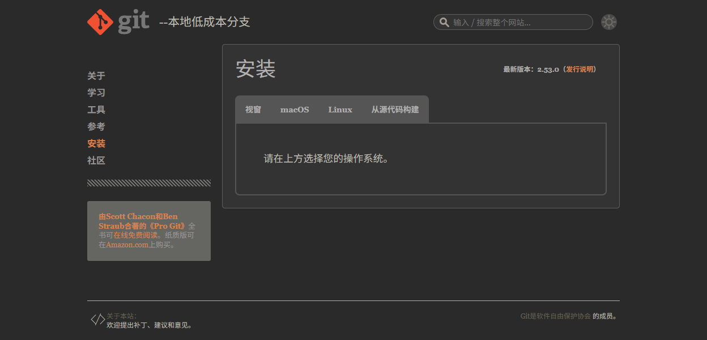

### 1.2 安装 Git（Windows 示例）

运行下载的 `.exe` 文件，大部分选项保持默认即可。但下面两个关键步骤需要留意：

- **选择默认编辑器**：建议选 VSCode（Use Visual Studio Code as Git's default editor）。
- **调整 PATH 环境**：选择 “Git from the command line and also from 3rd-party software”（推荐）。

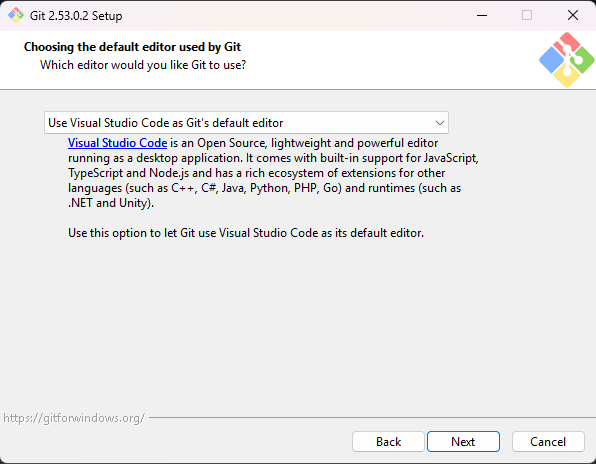

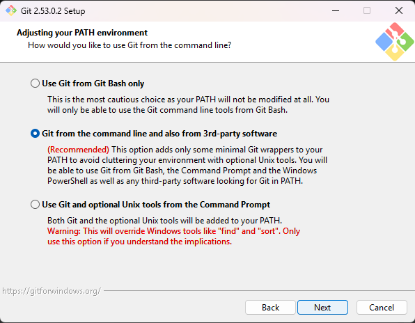

其他步骤连续点击 “Next” 完成安装。macOS 用户可使用 `brew install git`，Linux 用户使用系统包管理器。

### 1.3 验证安装

打开终端（Windows 用 cmd 或 PowerShell，macOS/Linux 用 Terminal），输入：

```bash
git --version
```

如果正确显示版本号（如 `git version 2.53.0`），说明安装成功。

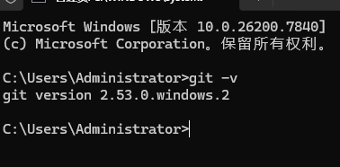

### 1.4 配置用户信息

Git 会记录每次提交的作者，请设置全局用户名和邮箱（最好和 GitHub 账号一致）：

```bash
git config --global user.name "你的名字"
git config --global user.email "你的邮箱"
```

## 2. Git 核心概念速览

- **工作区**：你电脑里能看到的项目文件夹。
- **暂存区**：临时存放准备提交的文件（VSCode 中的 “Staged Changes”）。
- **本地仓库**：`.git` 文件夹，保存所有历史版本。
- **远程仓库**：如 GitHub、GitLab 上的项目副本。

日常操作流程：修改文件 → 暂存（Stage） → 提交（Commit） → 推送到远程（Push）。

## 3. 在 VSCode 中使用 Git（重点）

VSCode 内置了强大的 Git 支持，大多数操作不需要输入命令。我们通过一个实际例子来学习。

### 3.1 打开源代码管理面板

左侧活动栏点击 **源代码管理** 图标（或按 `Ctrl+Shift+G`）。如果当前文件夹还不是 Git 仓库，面板会显示 “初始化仓库” 按钮。

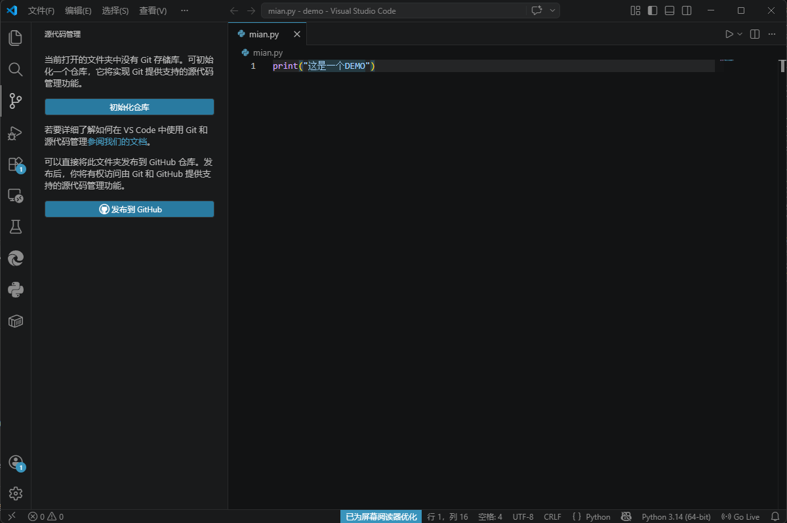

### 3.2 初始化仓库或克隆现有项目

**方式一：初始化新仓库**
点击 “初始化仓库” 按钮，VSCode 会在当前目录创建 `.git` 文件夹。

**方式二：克隆远程仓库**
按 `Ctrl+Shift+P` 打开命令面板，输入 `Git: Clone`，然后粘贴远程仓库地址（如 `https://github.com/用户名/仓库名.git`），选择本地存放位置即可。

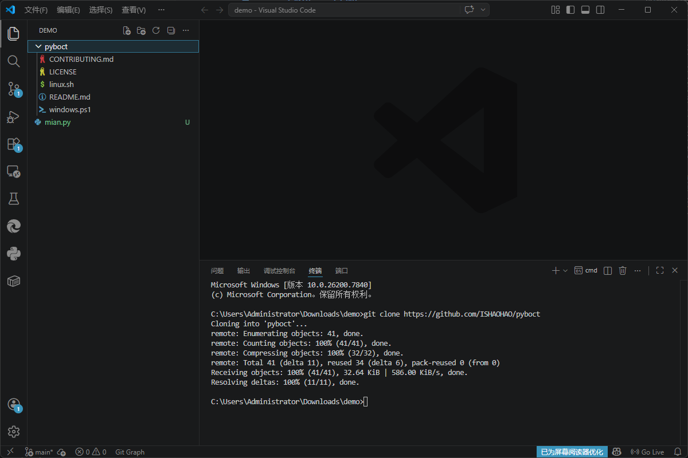

### 3.3 基本提交流程

1. **修改文件**：新建或编辑文件（例如 `main.py`）。
2. **暂存更改**：在源代码管理面板中，文件会出现在 “更改” 区域。鼠标悬停文件右侧，点击 **+** 号（暂存）。也可以点击文件旁的 “+” 暂存所有更改。

   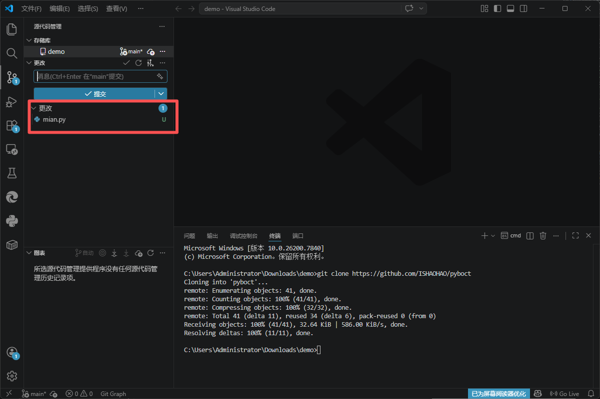

3. **提交**：在顶部的消息框中输入本次修改的说明（如 “首次提交”），然后点击上方的 **✔️ 提交** 按钮（或按 `Ctrl+Enter`）。

   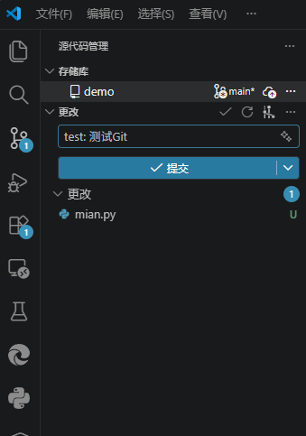

### 3.4 查看历史与版本对比

- 点击源代码管理面板右上角的 **···**（更多操作） → **查看历史**（或 **View History**），可以打开提交记录视图。
- 在某个文件上右键选择 **打开更改**（Open Changes），可以对比当前文件与最近提交的差异。

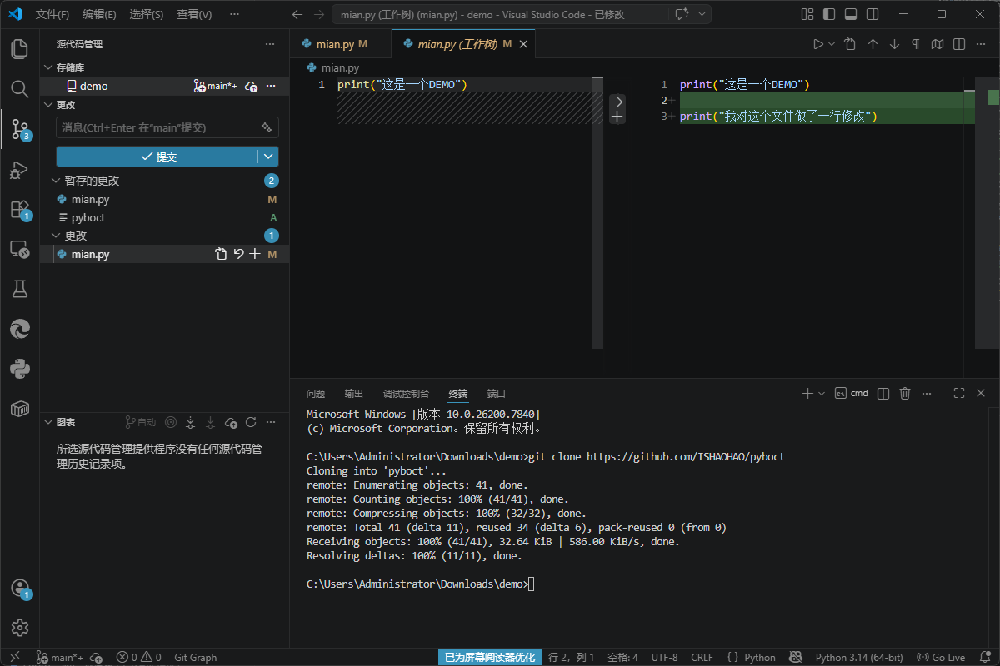

### 3.5 推送与拉取远程仓库

当本地有提交后，就可以同步到远程仓库（例如 GitHub）。

- **推送**：点击源代码管理面板底部的 **同步更改** 按钮（或者状态栏的圆圈图标），如果是首次推送，VSCode 会提示你选择远程仓库地址。
- **拉取**：同样点击同步按钮即可拉取远程最新更改。

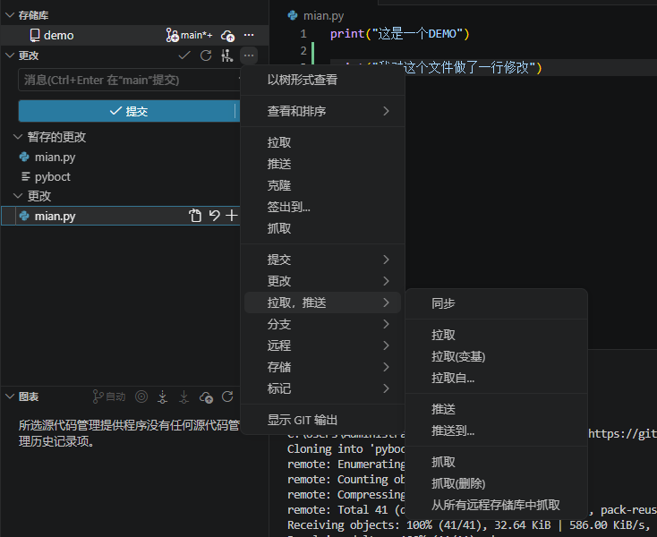

### 3.6 分支管理（简单操作）

- 点击 VSCode 左下角状态栏的分支名（默认 `main` 或 `master`）。
- 在弹出菜单中选择 **创建新分支**，输入分支名即可切换。

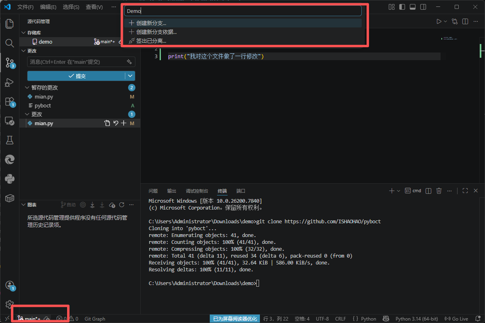

## 4. 实战：将本地项目推送到 GitHub

1. **在 GitHub 上新建一个空仓库**（不要勾选 “Initialize this repository with a README”）。
2. 复制仓库地址（HTTPS 或 SSH）。
3. 回到 VSCode，打开项目文件夹，按前面方法初始化仓库并完成一次提交。
4. 执行推送：点击状态栏的同步图标 → 选择 “发布到 GitHub”（Publish to GitHub）→ 粘贴远程地址 → 选择分支（通常是 main）。
5. 刷新 GitHub 页面，就能看到你的代码了。

如果遇到认证问题，推荐使用 GitHub CLI 或生成个人访问令牌（Personal Access Token），VSCode 会引导你登录。

## 5. 常见问题与技巧

- **撤销暂存**：在 “暂存的更改” 区域点击文件右侧的 **–** 号。
- **丢弃更改**：在 “更改” 区域右键文件选择 **放弃更改**（小心操作，会丢失未提交修改）。
- **解决冲突**：当拉取代码产生冲突时，VSCode 会高亮冲突文件，编辑器内提供 “接受当前更改”、“接受传入更改” 等按钮，非常直观。
- **Git 忽略文件**：在项目根目录创建 `.gitignore` 文件，写入不需要版本控制的文件/文件夹（如 `node_modules`、`.env`）。

## 6. 总结

现在你已经掌握了 Git 在 VSCode 中的可视化使用方法。不必再死记硬背 `git add`、`git commit` 等命令，日常开发时通过鼠标点击和快捷键就能高效完成版本管理。如果遇到更复杂的操作（如 rebase、cherry-pick），再去查阅命令也不迟。
