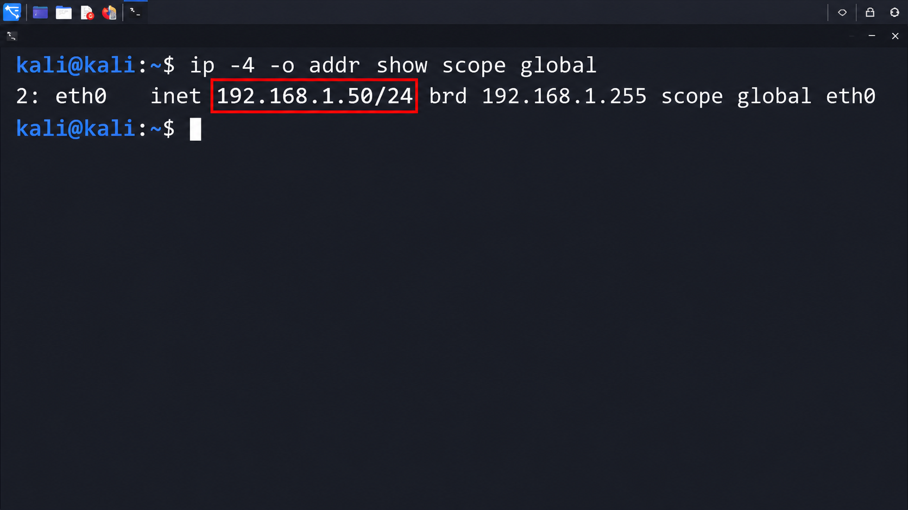
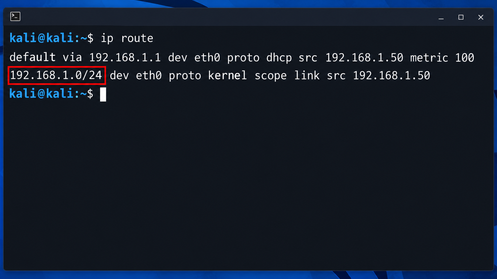
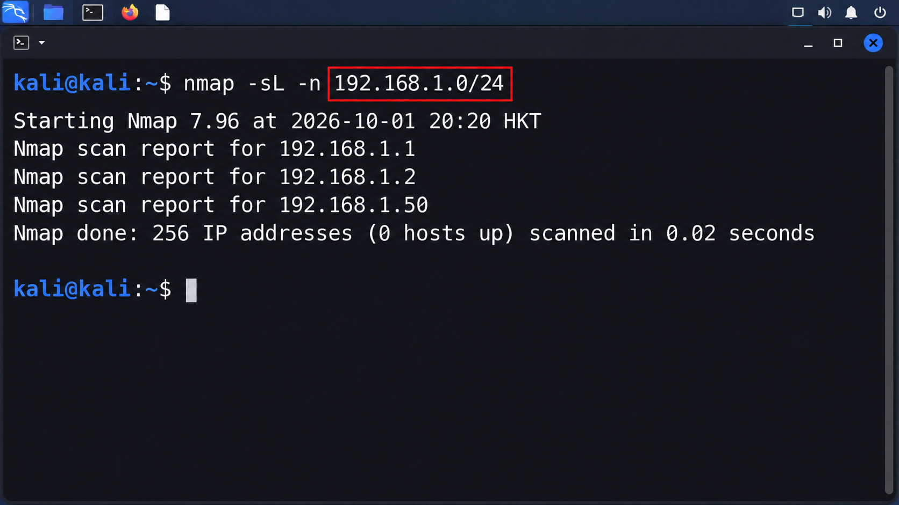
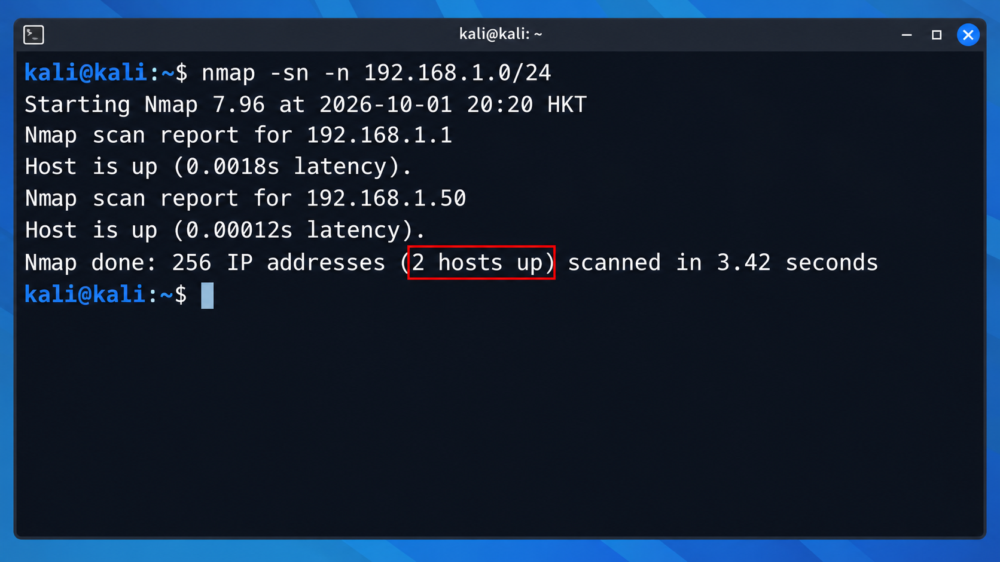
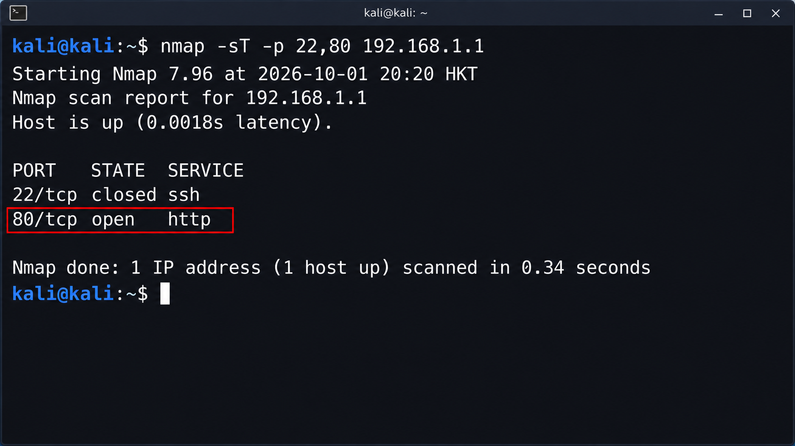
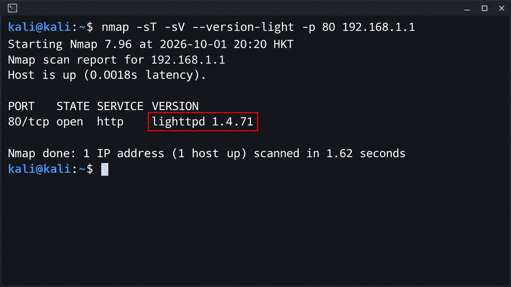
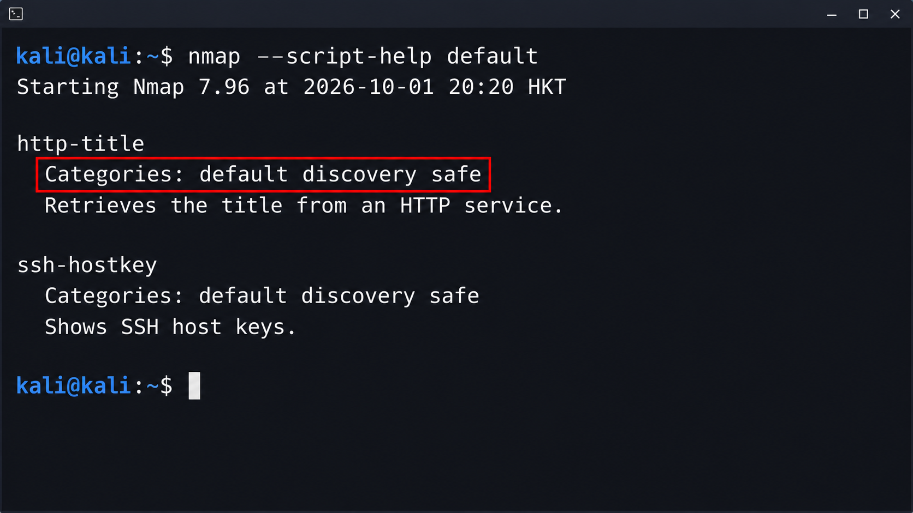
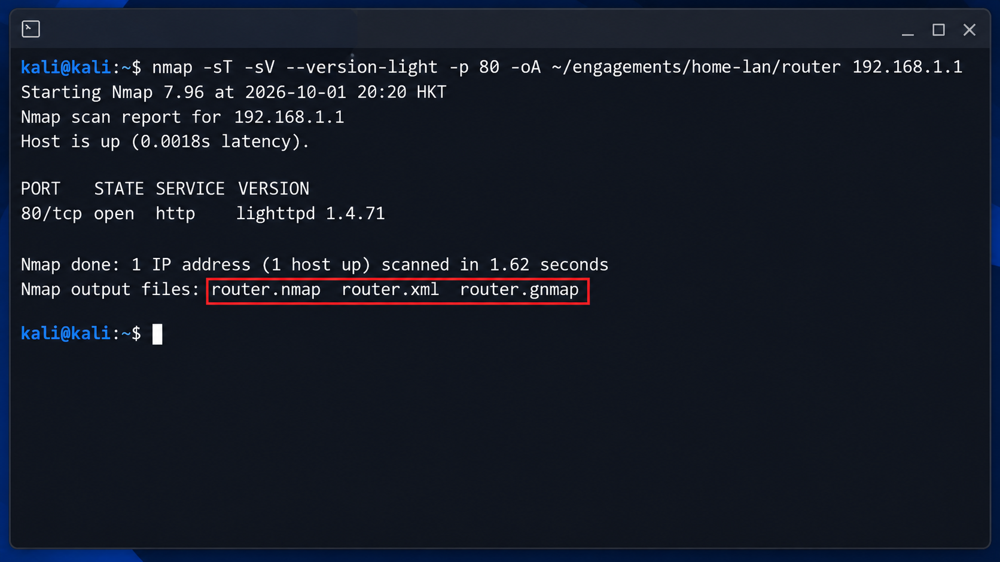

这篇文章面向刚开始接触 Kali Linux 的读者，重点不是系统运维，而是**渗透测试前期最基础的信息收集命令**。第一轮练习不要求你额外搭建靶机：直接在 VMware 中启动 Kali，先识别自己管理的家庭或个人实验局域网设备；再仅对你自己控制、或已明确获得逐台授权的设备，学习端口与服务识别。

所有扫描都会产生网络流量，并可能被记录或触发告警。本文以家庭局域网常见的私有地址网段为例；运行前必须确认路由器与目标设备由你管理，或你已获得明确授权，且授权范围包含目标地址、允许方法、时间窗口和联系人。

> 本文使用 RFC 1918 私有地址和实验服务输出作为示例。不要对公共 IP、陌生域名、公司网络或他人设备照搬命令。

## 1. VMware Kali 接入自己的局域网

本篇以 Windows 上的 VMware Workstation 为例。Kali 官方提供 VMware 预构建虚拟机镜像；下载后校验下载页给出的 SHA256 值，再在 VMware 中打开镜像目录里的 `.vmx` 文件。首次启动并完成初始化后，立即为 Kali 创建一个“干净基线”快照，以便实验出错时回退。

在 Kali 虚拟机关闭状态下，打开 **虚拟机设置 → 网络适配器**，完成以下设置：

1. 选择“桥接（Bridged）”，并在需要时选择实际联网的物理网卡；不要选择不确定用途的 VPN、公司网卡或虚拟网卡。
2. 勾选“已连接”和“启动时连接”，然后启动 Kali。
3. 在 Kali 终端中确认它已从你自己的路由器取得局域网地址。先执行下面这一条：

```bash
ip -4 -o addr show scope global
```



*红框中的 `IP/前缀` 是 Kali 虚拟机自己的地址，例如 `192.168.1.50/24`；它不是后续要扫描的目标地址。*

再查看路由表：

```bash
ip route
```



*红框中的网段是后续主机发现的候选范围。请以你的实际输出为准。*

例如，Kali 显示地址为 `192.168.1.50/24`、默认路由为 `192.168.1.1` 时，局域网可写为 `192.168.1.0/24`。这只是地址换算示例；务必以你实际看到的网段为准。先把网段写入变量，后续命令直接使用：

```bash
export LAB_CIDR='192.168.1.0/24'
```

继续到第 4 节，先列出目标地址，再做主机发现。这一步不要求你先创建靶机。不要根据在线结果继续对不属于你、或未获得明确授权的设备做端口、服务或脚本扫描。选定一个你自己控制的设备后，再设置 `TARGET_IP`，供后文的单主机练习使用：

```bash
export TARGET_IP='192.168.1.1'
printf 'LAN: %s\\nSelected device: %s\\n' "$LAB_CIDR" "$TARGET_IP"
```

> “本机局域网”不自动等于可扫描范围。公司、学校、宿舍、酒店、公共 Wi-Fi 或来源不明的网络均不属于本篇练习范围。

## 2. 先确认授权范围

在运行 Nmap 前，先把范围写清楚，而不是先敲命令。一个最小的授权靶场记录应包含：

| 项目 | 例子 |
| --- | --- |
| 扫描来源 | 自己的 Kali 虚拟机 |
| 允许目标 | 自己管理的私有网段，或自己控制的单个设备 |
| 允许方法 | 主机发现、TCP 连接扫描、服务版本识别 |
| 禁止方法 | 暴力猜测、拒绝服务、漏洞利用、绕过与密码攻击 |
| 时间窗口 | 约定的实验时间 |
| 停止条件 | 靶机异常、网络不稳定、授权方要求停止 |

初学阶段先使用上一节的家庭或个人实验局域网，完成主机发现；再只选择一个自己控制的设备作为单主机练习目标。先确认 Kali 本机接入了正确网段：

```bash
ip addr
ip route
```

如果默认路由、网卡地址或虚拟网卡模式不正确，先修正实验网络，再开始扫描。不要把“扫不到靶机”直接当成某种防护结论。

## 3. 认识 Nmap 与最小扫描流程

先确认 Nmap 版本和本地帮助：

```bash
nmap --version
man nmap
nmap --help
```

一次可复现的基础扫描通常遵循这个顺序：

1. 确认扫描范围是否正确；
2. 发现存活主机；
3. 对单个已授权主机枚举少量端口；
4. 识别已开放服务；
5. 仅在授权允许时运行默认脚本；
6. 保存命令、原始输出与时间，形成可复查记录。

不要一上来使用宽泛网段、全端口、高速率或“全功能”组合参数。范围越小、步骤越清楚，结果越容易解释，也越便于在异常时立即停止。

## 4. 主机发现：先找出靶场中在线的设备

先用 `-sL` 列出准备检查的地址。它不会向目标主机发送数据包，可用来再次确认范围：

```bash
nmap -sL -n "$LAB_CIDR"
```



*红框是你将要处理的网段。若它不是自己的家庭或个人实验网段，立即停止并修正 `LAB_CIDR`。*

确认无误后，`-sn` 表示“只做主机发现，不进行端口扫描”；`-n` 关闭反向 DNS 解析，让输出更聚焦于 IP 地址：

```bash
nmap -sn -n "$LAB_CIDR"
```



*红框显示本次发现的在线设备数量；它不等于可继续测试的目标数量。*

常见输出字段：

- `Host is up`：Nmap 从探测响应判断该地址可达；不表示所有服务都可访问。
- `latency`：一次探测观察到的往返延迟，不等同于稳定网络性能。
- `Nmap done`：扫描的地址数、发现的在线主机数和耗时。

主机发现不是“无痕”操作，依然会向目标网段发送探测流量；它只是把工作限制在识别在线主机，而不是继续进行端口扫描。

## 5. 端口枚举：从少量明确端口开始

端口是网络服务监听连接的入口。对已确认且被授权的单个自有设备，先检查少量端口，而不要一次扩大范围：

```bash
nmap -sT -p 22,80 "$TARGET_IP"
```



*红框表示开放的端口与服务名称。示例中的 `80/tcp` 是一项观察结果，不代表所有家庭设备都会开放该端口。*

参数含义：

| 参数 | 含义 |
| --- | --- |
| `-sT` | TCP connect 扫描；非特权账户下常用，会建立完整 TCP 连接，因此更容易被服务日志记录 |
| `-p 22,80` | 只检查指定端口；用逗号分隔 |
| `"$TARGET_IP"` | 已授权的单个设备地址 |

Nmap 的端口状态不只会显示 `open`：

- `open`：探测到有服务在监听该端口。
- `closed`：目标可达，但该端口当前没有服务监听。
- `filtered`：探测结果被防火墙或网络过滤影响，Nmap 无法确认端口状态。

## 6. 服务与版本识别：端口号不是最终结论

端口号只能提供初步猜测，服务可能运行在非标准端口。`-sV` 会在已发现的开放端口上进行服务与版本识别；`--version-light` 降低识别强度，适合先在靶场中学习输出格式：

```bash
nmap -sT -sV --version-light -p 22,80 "$TARGET_IP"
```



*红框是 Nmap 对服务产品和版本的识别结果，属于待确认信息，不应直接当成绝对结论。*

阅读结果时，把它当作“待验证的观察”，而不是绝对事实：

| 输出列 | 应如何理解 |
| --- | --- |
| `PORT` | 协议和端口号，例如 `22/tcp` |
| `STATE` | Nmap 对端口状态的判断 |
| `SERVICE` | 根据端口和探测结果推测的服务类型 |
| `VERSION` | 探测到的产品、版本或附加信息；可能不完整或有误判 |

服务识别会额外与开放端口交互，因此只应对授权目标运行。它的价值在于帮助你建立下一步的验证计划，例如确认某个服务是否确实属于自己的设备，而不是立即尝试漏洞利用。

## 7. 默认 NSE 脚本：先读说明，再决定是否运行

Nmap 的 NSE（Nmap Scripting Engine）可以为已发现的服务补充信息。`-sC` 等价于 `--script=default`，会运行默认脚本集合：

```bash
nmap --script-help default
```



*红框是脚本分类。先读脚本用途与分类，再判断是否在授权范围内；不要把“默认”理解成“无影响”。*

运行前应阅读每个脚本的说明和可能影响。即使是默认脚本集合，其中也可能存在被视为有侵入性的脚本；不要把 `-sC` 或更宽泛的组合参数当成“默认安全”。首次练习到此为止即可，脚本执行应留到范围和影响都被单独确认之后。

以下内容不属于本篇基础练习，也不应在没有明确授权时尝试：暴力猜测、拒绝服务、漏洞利用、规避检测、伪造来源或扩大扫描范围。

## 8. 保存结果：命令、原始输出与时间同样重要

扫描结束后，不能只记住屏幕上的几行结果。应保存本次使用的命令、范围、开始/结束时间、工具版本和原始输出。Nmap 的 `-oA` 可同时生成三种格式：普通文本、XML 和 grepable 输出。

先执行 `mkdir -p ~/engagements/home-lan` 创建结果目录，再对已获授权的单个设备执行并保存：

```bash
nmap -sT -sV --version-light -p 80 \
  -oA ~/engagements/home-lan/router \
  "$TARGET_IP"
```



*红框中的三个文件分别保存普通文本、XML 与 grepable 输出；将 `router` 改为你自己的设备标识即可。*

上述命令会生成：

| 文件 | 用途 |
| --- | --- |
| `router.nmap` | 便于人工阅读的普通文本输出 |
| `router.xml` | 便于工具处理和后续转换的结构化输出 |
| `router.gnmap` | 便于快速筛选的 grepable 输出；新流程仍建议优先保留 XML 和普通文本 |

不要为了“好看”手工修改原始扫描结果。若需要写结论，应单独写笔记，把结论与对应的原始证据、命令和时间关联起来。

## 9. 一次可控的自有局域网练习

确认上一节已经设置好 `LAB_CIDR` 与 `TARGET_IP` 变量后，按文章中的单命令截图依次练习即可：先看本机 IP，再看路由网段；接着列出目标、进行主机发现；最后只对一个自有设备检查限定端口、识别服务并保存结果。每一步都应确认输出符合预期后，再进入下一步。

如果发现目标异常、网络质量明显下降、出现未预期服务、或授权方要求停止，立即按约定停止后续扫描，保留已有记录并通知相关人员。不要通过提高速度、跳过发现阶段或追加更多脚本来“解决”未知结果。

## 10. 常见误区

- **把在线主机当成可测试目标**：在线只代表地址有响应，是否可测取决于授权范围。
- **把端口号当成服务结论**：端口映射可能不标准，服务与版本识别也可能存在误判。
- **一开始就扫大网段或所有端口**：这会增加流量、噪声和误操作风险，也不利于理解每个选项的作用。
- **忽略输出保存**：没有原始输出、时间与命令，就很难复查结果或形成可靠报告。
- **默认脚本等于无影响**：官方文档明确提示默认脚本中可能包含有侵入性的内容；脚本执行必须包含在授权范围内。

## 官方参考

- [Kali Linux：VMware 预构建虚拟机镜像](https://www.kali.org/get-kali/)
- [Nmap：主机发现与 `-sn`](https://nmap.org/book/man-host-discovery.html)
- [Nmap：TCP connect 扫描 `-sT`](https://nmap.org/book/scan-methods-connect-scan.html)
- [Nmap：服务与版本识别 `-sV`](https://nmap.org/book/man-version-detection.html)
- [Nmap：NSE 脚本使用与风险说明](https://nmap.org/book/nse-usage.html)
- [Nmap：输出格式与 `-oA`](https://nmap.org/book/man-output.html)
