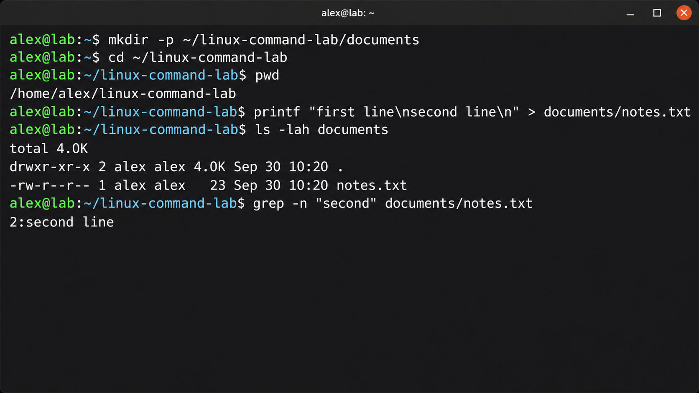
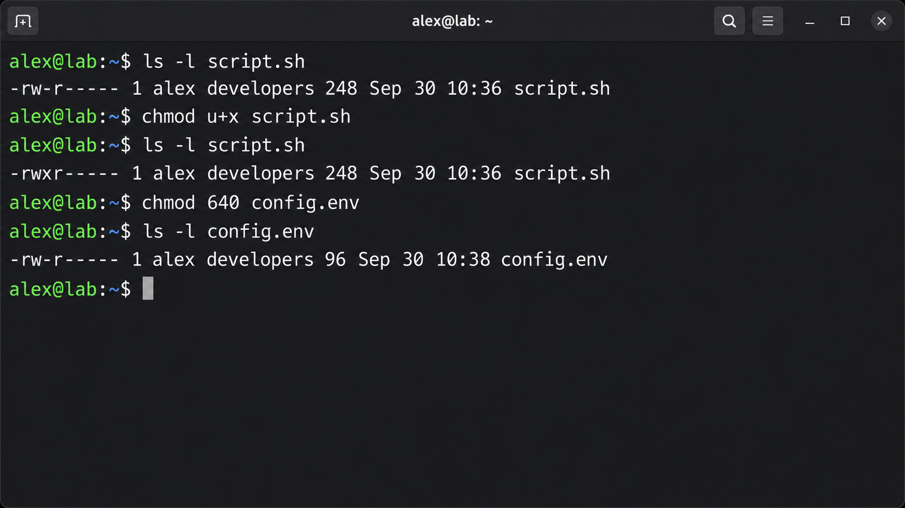
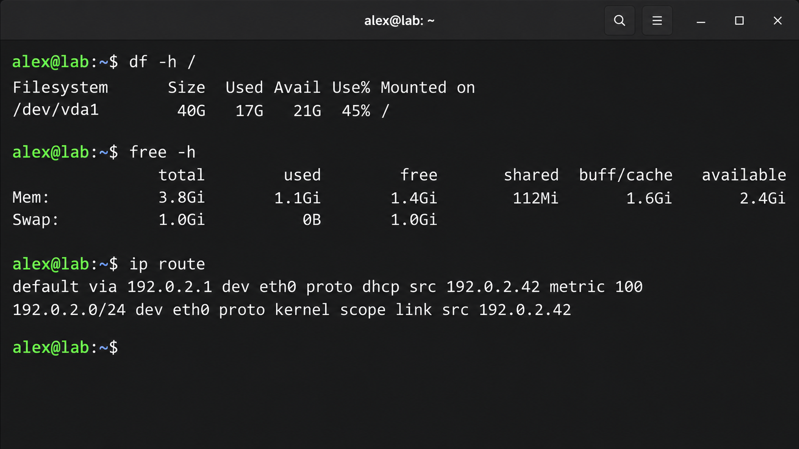
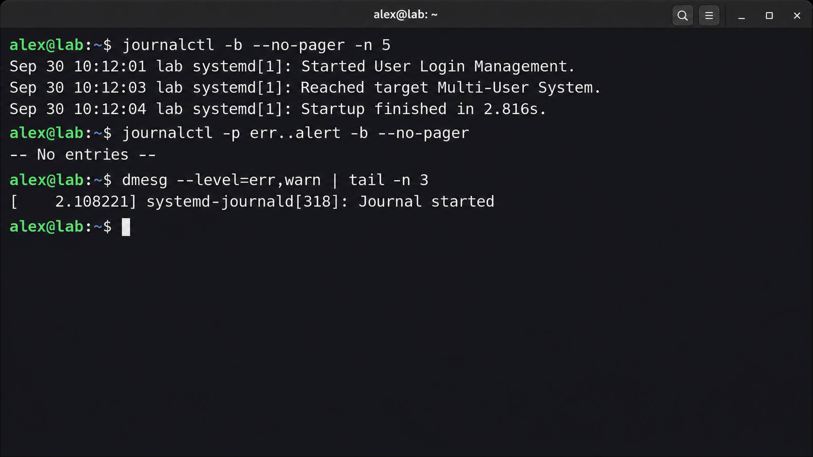

这是一篇面向新手的 **Linux 通用基础命令** 文章，只挑选第一次使用 Linux 时最常遇到、最值得先掌握的命令：定位目录、查看与编辑文件、搜索内容、管理权限、查看进程、检查磁盘内存、确认网络与阅读日志。它不依赖某个特定发行版或某项专业工具，适合作为日常使用 Linux 的第一份命令清单。

很多人第一次打开 Linux 终端时，会觉得光标后的那一行字符有些陌生。其实终端并不神秘：它只是用文字向系统发出明确指令的界面。掌握这批高频命令后，查看文件、管理软件、定位故障都会快很多。

本文以常见的 Bash / Zsh 环境为例，适用于 Debian、Ubuntu、CentOS Stream、Rocky Linux、AlmaLinux、Arch 等主流发行版。不同发行版的包管理命令会有差异，文件、权限、进程和网络诊断部分则大多通用。

> 本文中的 `$` 表示普通用户提示符，`#` 表示 root 用户提示符。复制命令时不要复制前面的提示符。除非确有必要，不建议直接以 root 身份日常操作。

## 1. 先认识终端中的几个概念

一条命令通常由三部分组成：**命令名**、**选项**和**参数**。

```bash
ls -lah /var/log
```

- `ls`：命令名，用来列出目录内容。
- `-lah`：选项，改变输出方式；多个短选项经常可以合并。
- `/var/log`：参数，也就是命令要处理的对象。

常用快捷键也值得马上记住：

| 快捷键 | 作用 |
| --- | --- |
| `Tab` | 自动补全命令、文件或目录名；按两次可查看候选项 |
| `↑` / `↓` | 浏览历史命令 |
| `Ctrl + C` | 终止当前正在前台执行的命令 |
| `Ctrl + L` | 清屏，等同于 `clear` |
| `Ctrl + A` / `Ctrl + E` | 跳到当前命令行开头 / 末尾 |
| `Ctrl + R` | 反向搜索历史命令 |

遇到不认识的命令，先看帮助，不要急着在生产服务器上试错：

```bash
命令 --help
man 命令
```

例如 `man ls` 会打开 `ls` 的手册页；在手册中输入 `/关键词` 搜索，按 `n` 查找下一个匹配项，按 `q` 退出。

## 2. 目录与路径：你现在位于哪里

Linux 的目录结构从根目录 `/` 开始。与 Windows 的盘符不同，磁盘、U 盘和网络挂载通常都会挂到这棵目录树的某个位置。

```bash
pwd                 # 显示当前工作目录
ls                  # 列出当前目录内容
ls -la              # 包含隐藏文件（以 . 开头）和详细信息
cd /etc             # 切换到 /etc
cd ..               # 返回上一级目录
cd ~                 # 回到当前用户的家目录
cd -                # 回到上一次所在目录
```

路径分为两类：

- **绝对路径**从 `/` 开始，例如 `/etc/ssh/sshd_config`，不受当前位置影响。
- **相对路径**从当前目录开始，例如 `./scripts/deploy.sh`；其中 `.` 代表当前目录，`..` 代表上一级目录。

几个常见顶级目录的用途如下：

| 目录 | 常见用途 |
| --- | --- |
| `/home` | 普通用户的家目录 |
| `/root` | root 用户的家目录 |
| `/etc` | 系统和服务配置文件 |
| `/var/log` | 系统与服务日志 |
| `/tmp` | 临时文件，通常会被系统定期清理 |
| `/usr/bin`、`/bin` | 大量可执行命令所在的位置 |
| `/opt` | 第三方软件常用安装位置 |

## 3. 文件与目录操作

### 3.1 创建、复制、移动与删除

```bash
mkdir notes                  # 创建目录
mkdir -p project/src/assets  # 连同不存在的父目录一起创建
touch notes/todo.txt         # 创建空文件；文件存在时更新修改时间
cp todo.txt todo.backup.txt  # 复制文件
cp -r assets assets.backup   # 递归复制目录
mv todo.txt done.txt         # 重命名文件
mv done.txt notes/           # 移动文件
```

删除操作要格外谨慎：

```bash
rm todo.backup.txt           # 删除单个文件
rmdir empty-dir              # 仅删除空目录
```

`rm` 默认不会进入“回收站”，删除后通常难以恢复。尤其要警惕 `rm -r`（递归删除目录）与 `rm -f`（忽略提示和不存在的文件）。执行递归删除前，建议先用 `ls` 确认目标路径，并尽量写出完整路径；不要在不确定变量内容时执行这类命令。

### 3.2 查看文件内容

```bash
cat /etc/hostname            # 输出较短文件的全部内容
less /var/log/syslog         # 分页查看大文件；q 退出
head -n 20 file.txt          # 查看前 20 行
tail -n 50 file.txt          # 查看最后 50 行
tail -f app.log                    # 持续跟踪新增日志；Ctrl + C 结束
wc -l file.txt               # 统计文件行数
```

`cat` 适合小文件；日志或大型配置文件更适合 `less`。使用 `less` 时可输入 `/error` 搜索错误关键词，按 `n` 跳到下一个结果。

### 3.3 查找文件和内容

```bash
find /var/log -type f -name "*.log"       # 在目录中查找 .log 文件
find . -type f -mtime -7                    # 查找 7 天内修改过的文件
grep -n "Listen" /etc/ssh/sshd_config      # 在文件中查找文本并显示行号
grep -RIn "TODO" ./src                      # 递归查找目录中的文本，忽略大小写
```

`find` 负责按名称、类型、时间等条件找文件，`grep` 则负责在文件内容中找文本。对无权限目录执行 `find` 时看到 “Permission denied” 并不代表命令失败，只表示当前用户无权读取那部分目录。



*在个人家目录中完成创建目录、查看文件和文本搜索，适合先在安全范围内练习。*

## 4. 文本处理与管道：把命令组合起来

管道符 `|` 会把左侧命令的输出交给右侧命令继续处理，是命令行效率的关键。

```bash
ps aux | grep "进程名"
df -h | sort -k 5
journalctl -u 服务名 --since "today" | less
```

常用的文本处理命令：

```bash
sort names.txt                 # 排序
sort -u names.txt              # 排序并去重
uniq -c names.txt              # 统计相邻重复行；通常先配合 sort
cut -d: -f1 /etc/passwd        # 以 : 分隔，取第 1 列
awk '{print $1, $3}' file.txt  # 按空白分列，输出第 1 和第 3 列
```

重定向用于把输出写入文件：

```bash
echo "hello" > hello.txt      # 覆盖写入；原内容会被替换
echo "world" >> hello.txt     # 追加写入；保留原内容
command 2> error.log           # 仅把错误输出写入文件
command > all.log 2>&1         # 把正常输出和错误输出都写入文件
```

`>` 会覆盖已有文件，操作前先确认文件名；只是想保留历史内容时，使用 `>>`。

## 5. 用户、权限与 sudo

### 5.1 当前身份与切换身份

```bash
whoami                 # 当前用户名
id                     # 用户 ID、组 ID 和所属组
groups                 # 当前用户所属组
sudo -v                # 刷新 sudo 授权，不执行具体管理操作
sudo 命令              # 以管理员权限执行一条命令
```

`sudo` 的原则是“只给需要的一条命令提权”。例如查看普通日志一般不需要 `sudo`，修改 `/etc` 下的配置才可能需要。不要把来路不明的整段命令直接加上 `sudo` 执行。

### 5.2 读、写、执行权限

```bash
ls -l script.sh
# -rwxr-xr-- 1 alice developers 120 Sep 30 10:00 script.sh
```

第一个字符表示文件类型：`-` 是普通文件，`d` 是目录。后面九个字符按三组划分，依次对应**所有者**、**所属组**和**其他用户**的读（`r`）、写（`w`）、执行（`x`）权限。

```bash
chmod u+x script.sh       # 给文件所有者添加执行权限
chmod 640 config.env      # 所有者可读写，组可读，其他用户无权限
chown alice:developers app.log  # 修改所有者和所属组（通常需要 sudo）
```

目录的 `x` 权限表示“可以进入或访问目录中的已知文件名”，并不单纯是“执行”。修改权限前，先确认应用或服务实际由哪个用户运行；过度使用 `chmod 777` 会显著扩大风险，通常不是解决权限问题的正确方法。

## 6. 软件包管理：先识别发行版

先查看系统信息，再选择对应的包管理器：

```bash
cat /etc/os-release
uname -r
```

| 系统家族 | 常见包管理器 | 安装示例 |
| --- | --- | --- |
| Debian、Ubuntu | `apt` | `sudo apt install curl` |
| RHEL、Rocky、AlmaLinux、CentOS Stream | `dnf` | `sudo dnf install curl` |
| 较旧的 RHEL 系系统 | `yum` | `sudo yum install curl` |
| Arch Linux | `pacman` | `sudo pacman -S curl` |

以 Debian / Ubuntu 为例：

```bash
sudo apt update              # 刷新软件包索引
apt list --upgradable        # 查看可升级的软件
sudo apt upgrade             # 安装可用升级
apt search 软件包名          # 搜索软件包
apt show 软件包名            # 查看软件包信息
sudo apt remove 软件包名     # 卸载软件包，配置文件可能保留
```

升级服务器前，先阅读变更列表并确认维护窗口。涉及内核、数据库、Web 服务等关键组件时，备份和回滚方案比“立刻执行升级”更重要。

## 7. 进程、服务与计划任务

### 7.1 查看和管理进程

```bash
ps aux                       # 查看当前进程快照
ps aux | grep "进程名"      # 按关键字查找进程；结果可能包含 grep 自身
pgrep -a 进程名              # 按进程名查找并显示完整命令行
top                          # 实时查看 CPU、内存和进程；q 退出
free -h                      # 查看内存和交换分区使用情况
```

结束进程时，优先发送可被程序正常处理的终止信号：

```bash
kill PID                     # 默认发送 SIGTERM，请程序自行退出
kill -9 PID                  # 强制终止；仅用于无响应时的最后手段
```

`kill -9` 不会给程序清理资源和写入缓冲数据的机会。若是由 systemd 管理的服务，优先使用 `systemctl`，不要直接杀死服务进程。

### 7.2 使用 systemd 管理服务

多数现代发行版使用 systemd：

```bash
systemctl status 服务名             # 查看服务状态和最近日志
sudo systemctl start 服务名         # 启动服务
sudo systemctl stop 服务名          # 停止服务
sudo systemctl restart 服务名       # 重启服务
sudo systemctl reload 服务名        # 重新加载配置（服务支持时）
sudo systemctl enable --now 服务名  # 设为开机启动并立即启动
systemctl is-enabled 服务名         # 检查是否开机启动
```

将示例中的“服务名”替换为实际 unit 名称；不同发行版、软件包和服务实现的名称可能不同。修改服务配置后，先查阅该服务的官方文档并运行其提供的配置检查命令，确认通过再 reload 或 restart，能明显降低错误配置导致服务中断的风险。



*通过 `ls -l` 观察权限变化，再用 `chmod` 做最小范围调整。*

## 8. 磁盘、内存与系统信息

系统变慢或服务无法写文件时，先看资源状态，不要直接重启。

```bash
df -h                       # 各文件系统的容量和使用率
df -i                       # inode 使用率；小文件过多可能先耗尽 inode
du -sh /var/log             # 查看目录总大小
du -xh --max-depth=1 /var | sort -h  # 找出 /var 下较大的一级目录
lsblk                       # 查看磁盘、分区和挂载关系
mount | column -t           # 查看已挂载的文件系统
uptime                      # 运行时长、登录用户数和负载均值
free -h                     # 内存和 swap 使用情况
```

Linux 会尽可能使用空闲内存作为缓存，因此不能只看 `free` 一列判断“内存是否不足”。结合 `available`、swap 使用情况和实际进程占用再作判断。`du` 统计较大目录可能需要一些时间，生产机上不要对根目录频繁做全盘扫描。



*先读取磁盘、内存与路由信息，再判断资源或网络问题的范围。*

## 9. 网络连通性与端口排查

排查网络问题时，建议从“本机配置 → 域名解析 → 路由 → 服务监听”逐层确认。

```bash
ip addr                     # 查看网卡和 IP 地址
ip route                    # 查看路由表和默认网关
ping -c 4 8.8.8.8           # 测试到 IP 的基本连通性
ping -c 4 example.com       # 同时验证 DNS 解析和连通性
getent hosts example.com    # 用系统解析器查询域名
curl -I https://example.com # 请求 HTTP 响应头
ss -tulpn                   # 查看正在监听的 TCP/UDP 端口及进程
```

如果 `ping` 不通，不一定代表服务不可用：许多网络设备会禁用 ICMP。对 Web 服务可用 `curl` 验证，对端口可用 `ss` 确认本机是否监听，再结合防火墙、安全组和上游路由规则排查。

## 10. 日志是最可靠的线索之一

systemd 系统可通过 `journalctl` 查看日志：

```bash
journalctl -b                    # 本次启动后的系统日志
journalctl -b -1                 # 上一次启动的日志
journalctl -u 服务名 --since today # 指定服务今天的日志
journalctl -u 服务名 -f            # 实时跟踪指定服务的日志
journalctl -p err..alert -b       # 查看本次启动的高优先级错误
```

排障时，先记录故障发生的时间、受影响服务和报错原文，再围绕时间范围筛选日志。不要因为看到一条错误就立刻修改多个配置；一次只改变一个可验证因素，更容易找到真正原因。



*先按本次启动和优先级筛选系统日志，再按需查看内核消息。*

## 11. 一套适合新手的安全练习流程

下面的练习只会在当前用户的家目录中创建一个临时目录，适合先熟悉命令和路径：

```bash
mkdir -p ~/linux-command-lab/documents
cd ~/linux-command-lab
printf "first line\nsecond line\n" > documents/notes.txt
pwd
ls -lah documents
cat documents/notes.txt
grep -n "second" documents/notes.txt
cp documents/notes.txt documents/notes.backup.txt
mv documents/notes.backup.txt documents/archive.txt
find . -type f -name "*.txt"
```

确认练习文件无误后，如需清理，先查看目标，再删除这个明确创建的目录：

```bash
ls -lah ~/linux-command-lab
rm -r ~/linux-command-lab
```

这比一开始就在 `/etc`、`/var` 等系统目录练习安全得多。

## 12. 常见误区与下一步

- **看不懂命令就加 `sudo`**：权限变大不会让错误命令变正确，反而会扩大影响范围。
- **把网上命令整段粘贴执行**：先逐段理解变量、路径、重定向和删除操作，再决定是否执行。
- **只会重启服务或主机**：先看 `systemctl status`、`journalctl`、磁盘和端口，通常能保留更有价值的现场信息。
- **把密码写进命令历史**：命令行参数、Shell 历史和进程列表都可能暴露敏感信息；优先使用交互式输入、权限受控的配置文件或专门的凭据管理方式。

掌握这些基础命令后，建议继续学习 Shell 通配符、正则表达式、SSH、文件同步（如 `rsync`）、编辑器（`nano` 或 `vim`）和脚本编写。真正重要的不是背下所有参数，而是形成固定习惯：先查看、确认目标、再做最小范围的修改，并在修改后验证结果。
