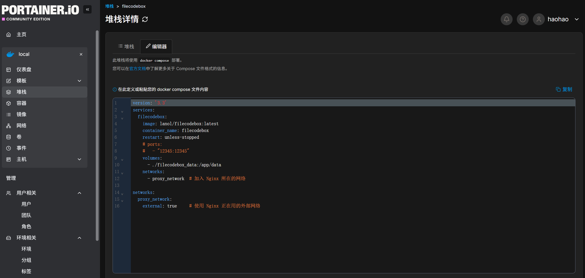
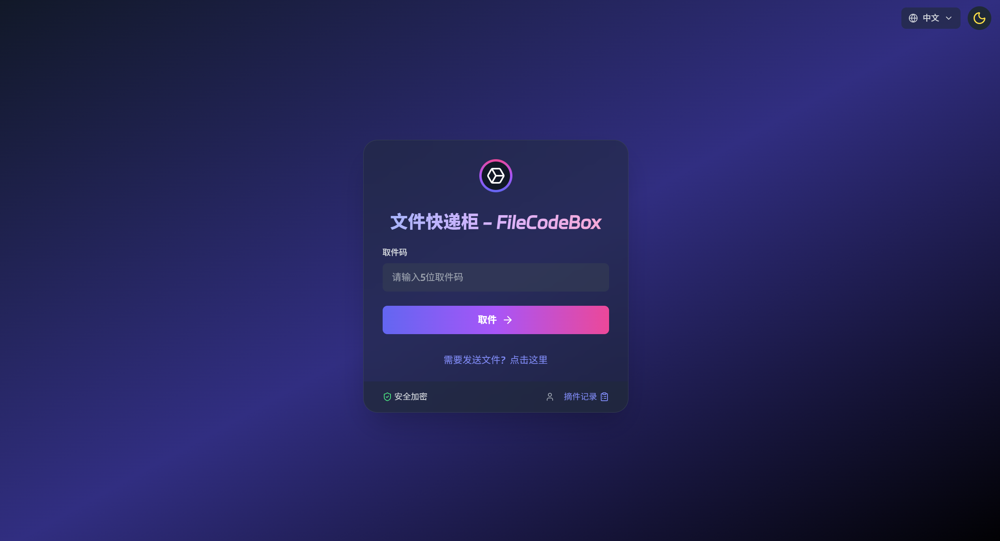

---

title: Panther-X2 盒子部署私有“文件快递柜”教程,自托管实现即传即下载
published: 2026-03-10
description: "本文介绍如何在 Docker 环境下部署 FileCodeBox，通过 Nginx 反向代理实现非标端口下的安全 HTTPS 访问，打造属于自己的即传即下私有服务。"
image: "FileCodeBox.png"
tags: ["Panther-X2", "Docker", "Nginx", "FileCodeBox"]
category: 教程
draft: false

---

> 封面图片来源：[vastsa/FileCodeBox](https://github.com/vastsa/FileCodeBox)

## 1. 简介

你是否有过这样的需求：在电脑上想传个文件到手机，或者想临时发个文件给远方的朋友，却不想忍受登录各种社交软件或云盘的繁琐？

**FileCodeBox（文件快递柜）** 就是为此而生的。它模仿了类似 AirPortal 的“取件码”逻辑：

* **即传即下**：上传文件，生成 5 位取件码。
* **口令取件**：对方输入口令，文件直接秒下。
* **阅后即焚**：支持设置下载次数和有效期。

本文将手把手带你在 **Panther-X2** 盒子上，利用 Portainer 和 Nginx 搭建这一神器，并解决家用公网环境下的 HTTPS 访问难题。

---

## 2. 环境准备

我的折腾环境如下，大家可以作为参考：

* **硬件设备**：Panther-X2（RK3566，性能强劲的 ARM 盒子）。
* **系统环境**：Armbian / Docker / Portainer。
* **关键组件**：已经运行好的 **Nginx 代理容器**（用于处理 SSL 证书和转发）。
* **前置坑点提示**：
  * **端口映射**：宿主机端口不能冲突，本文使用虚拟端口 **52000**。
  * **防火墙/安全组**：如果你使用华为云等云服务器做转发，记得在后台开启 **52000** 端口。
  * **网络逻辑**：所有容器必须在同一个 Docker 网络下（如 `proxy_network`），否则 Nginx 找不到快递柜。

---

## 3. 一步步安装部署

### 第一步：在 Portainer 中部署 Stacks

登录 Portainer，新建一个 Stack，粘贴以下 Docker Compose 代码：

```yaml
version: '3.3'
services:
  filecodebox:
    image: lanol/filecodebox:latest
    container_name: filecodebox
    restart: unless-stopped
    volumes:
      - ./filecodebox_data:/app/data
    networks:
      - proxy_network # 确保 Nginx 也能访问这个网络

networks:
  proxy_network:
    external: true # 使用已有的外部网络

```

**验证启动：** 部署后查看容器日志（Logs），看到 `应用初始化完成` 字样即代表成功。

**初始密码：** 默认管理密码通常为 `FileCodeBox2023`。

> 

---

### 第二步：配置 Nginx 反向代理

为了在外网通过 `https://drop.example.com:52000` 安全访问，我们需要修改 Nginx 配置。

在你的 Nginx `conf.d` 目录下新建 `filecodebox.conf`：

```nginx
# HTTPS 服务器
server {
    listen 52000 ssl;
    http2 on;
    server_name drop.example.com; # 换成你自己的域名

    # SSL 证书路径
    ssl_certificate /root/SSL/fullchain.pem;
    ssl_certificate_key /root/SSL/private.key;

    location / {
        proxy_pass http://filecodebox:12345; # 容器名:内部端口
        proxy_set_header Host $host;
        proxy_set_header X-Real-IP $remote_addr;
        proxy_set_header X-Forwarded-For $proxy_add_x_forwarded_for;
        proxy_set_header X-Forwarded-Proto $scheme;

        # 允许上传大文件，这里设置为 10G,因为的要传大文件，根据自己需求调整吧
        client_max_body_size 10G; 
    }
}

```

修改完成后，执行 `docker exec nginx-proxy nginx -s reload` 生效。

---

### 第三步：宿主机与防火墙设置

很多小伙伴配置完 Nginx 发现还是打不开，通常是卡在这里了：

1. **Docker 端口映射**：确保你的 Nginx 容器在创建时映射了 `52000:52000` 端口。如果没映射，需要 `docker compose up -d --force-recreate` 重新创建 Nginx 容器。
2. **安全组开放**：登录你的云服务后台（如华为云），在安全组规则中添加一条：**协议 TCP，端口 52000，源地址 0.0.0.0/0**。

> ！[转发端口](./OpenWrt.png)

---

## 4. 常见问题 & 排错

* **访问提示“拒绝连接”**：
执行 `sudo iptables -t nat -L DOCKER -n` 查看是否有 52000 的转发规则。如果没有，说明 Docker 容器没有正确绑定端口。
* **找不到后台地址**：
默认后台地址是 `你的域名:52000/#/admin`。
* **上传大文件报错 413**：
这是 Nginx 的限制，请确保配置文件里的 `client_max_body_size` 足够大。
* **管理密码不对**：
如果默认密码失效，进入容器 Console 执行 `rm -rf /app/data/*` 并重启，观察日志重新获取初始密码。

---

## 5. 总结

折腾完这套服务，Panther-X2 盒子的实用性又提升了一个档次：

> 

* **颜值极高**：简洁的磨砂玻璃风格 UI，放在哪都好看。
* **安全可控**：数据存在自己的 Panther-X2 里，不再担心隐私泄露。
* **全平台通用**：只要有浏览器，无论安卓、iOS 还是 Linux 都能轻松取件。

最舒服的瞬间，莫过于给朋友发一个 5 位数字，对方就能瞬间拿到你准备好的大文件。这种“快递柜”式的体验，真的是用了就回不去！

如果你也在折腾 Panther-X2 或者是私有云部署，欢迎在评论区交流心得！
