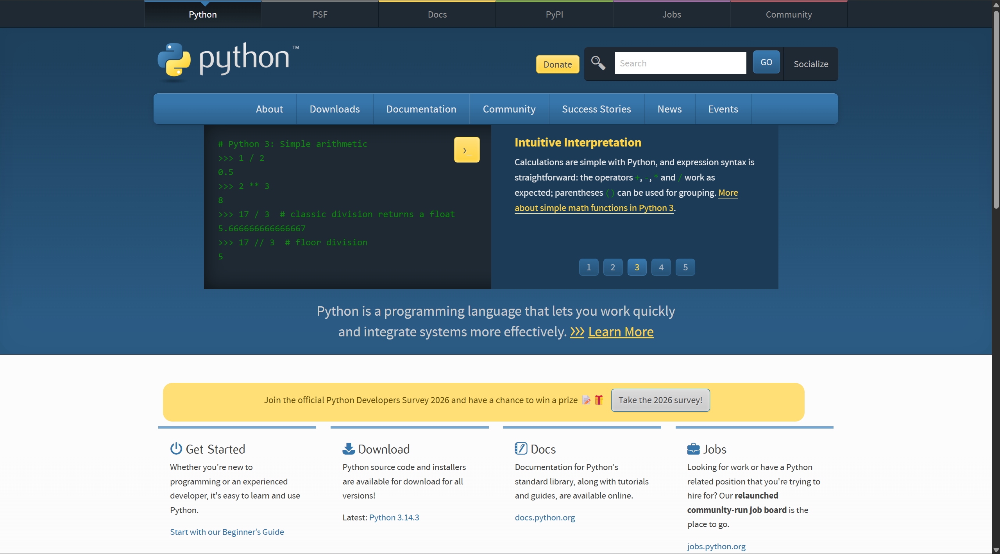
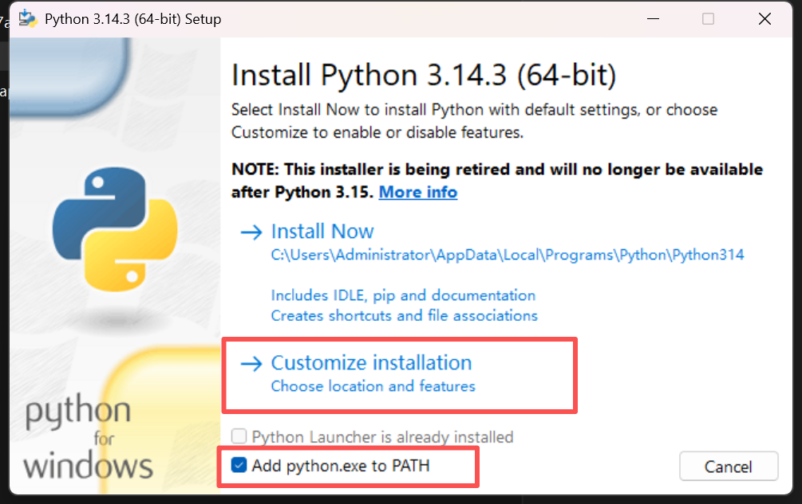
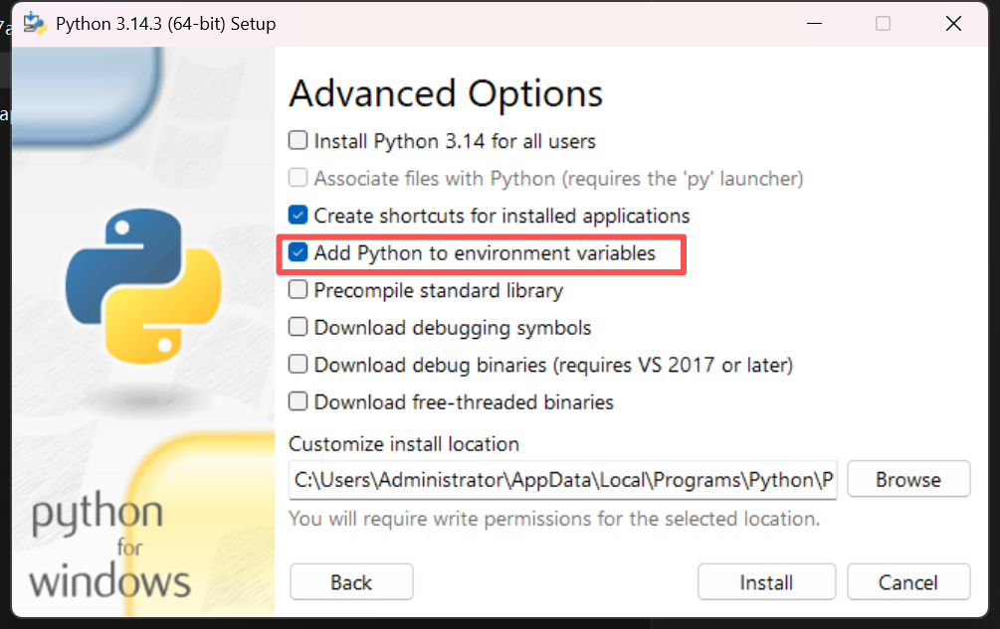
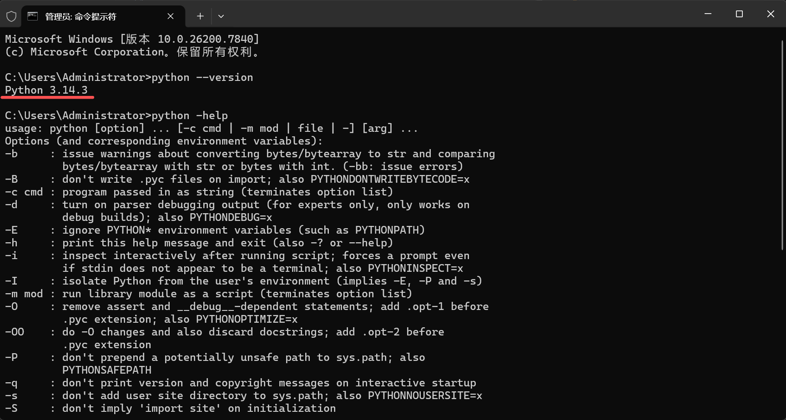
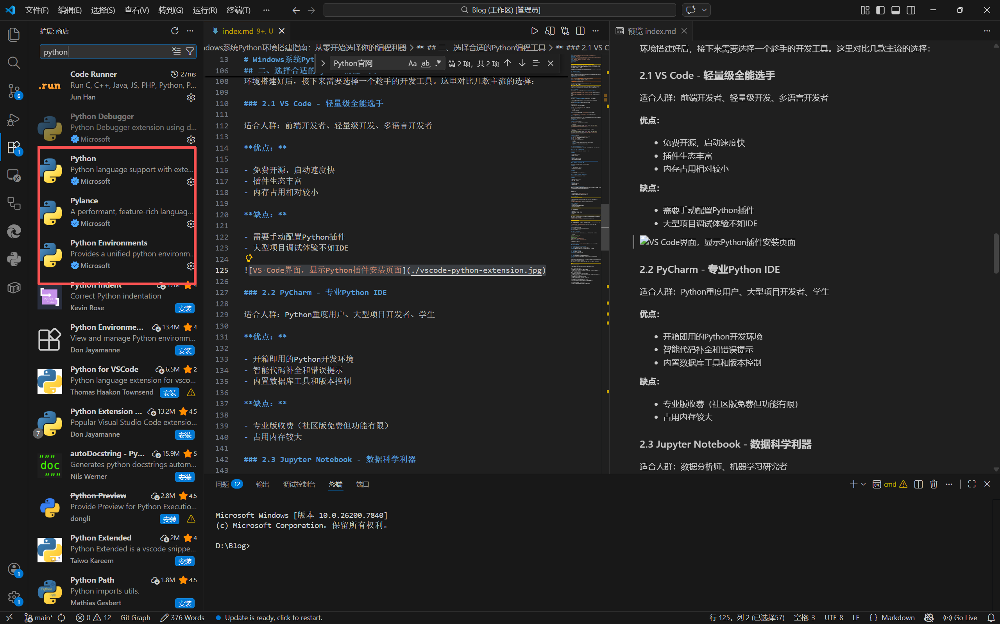
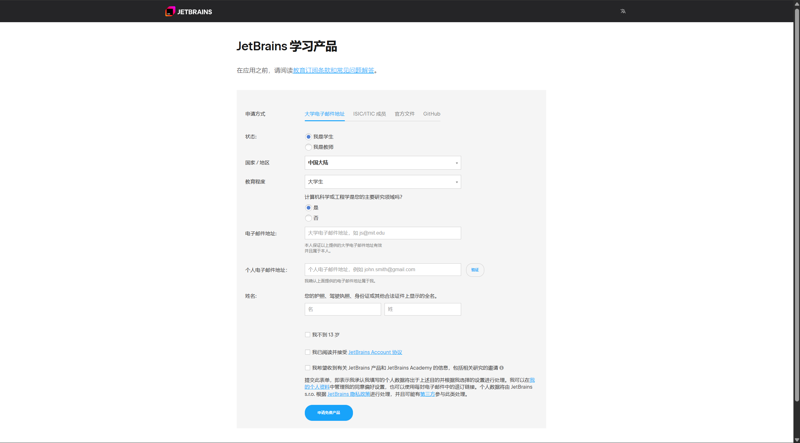
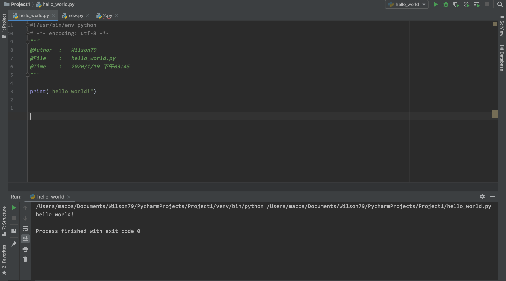

---

title: Windows系统Python环境搭建指南：从零开始选择你的编程利器
published: 2026-03-11
description: "详细讲解Windows系统下Python环境的搭建步骤，以及如何选择适合自己的编程工具，附赠PyCharm学生认证申请全流程。"
image: "./python.jpg"
tags: ["Python", "PyCharm", "环境搭建", "教程"]
category: 教程
draft: false

---

> 封面图片来源：[python.org](https://www.python.org/)

Python作为当前最热门的编程语言之一，以其简洁的语法和强大的生态吸引着越来越多的初学者。但对于Windows用户来说，如何正确搭建Python环境，选择合适的开发工具，往往成为入门的第一道坎。

本文将手把手教你完成Python环境的搭建，并帮你找到最适合自己的编程工具，最后还会分享PyCharm专业版的免费获取方法——学生认证全攻略！

## 一、Python环境搭建

### 1.1 下载Python安装包

首先，我们需要从官方网站下载Python安装包。虽然官网下载速度可能较慢，但为了保证文件安全，建议优先选择官方渠道。

**操作步骤：**

1. 打开浏览器，访问Python官网：<https://www.python.org/>
2. 将鼠标悬停在导航栏的"Downloads"按钮上
3. 网站会自动检测你的操作系统，显示对应的下载按钮



如果你觉得官网下载速度太慢，也可以使用国内镜像源：

| 镜像站 | 地址 | 特点 |
|-------|------|------|
| 清华大学TUNA | mirrors.tuna.tsinghua.edu.cn/python/ | 更新及时，高校网络优化 |
| 华为云镜像 | repo.huaweicloud.com/python/ | 稳定性高，支持断点续传 |

### 1.2 安装Python

下载完成后，双击运行安装包，这里有一个**非常重要的注意事项**：





**关键步骤：**

✅ 务必勾选 **"Add Python to PATH"** （将Python添加到环境变量）

> 当然如果你懒得弄乱七八糟的东西，可以直接安装，当然这是我不推荐的
> ![直接安装]

✅ 选择 **"Install Now"**（推荐）或自定义安装路径

✅ 等待安装完成

安装完成后，我们需要验证是否成功：

1. 按下 `Win + R` 键，输入 `cmd` 打开命令提示符
2. 输入以下命令并回车：

   ```bash
   python --version
   ```

3. 如果显示Python版本号（如 `Python 3.14.3`），说明安装成功

   

### 1.3 配置pip镜像源

pip是Python的包管理工具，用于安装第三方库。但默认的官方源在国外，下载速度较慢。我们可以配置国内镜像源加速下载。

**配置方法：**

**方法一：**使用自动化脚本

打开`PowerShell`,输入下面指令，启动换源脚本

```PowerShell
Set-ExecutionPolicy Bypass -Scope Process -Force; iex ((New-Object System.Net.WebClient).DownloadString('https://raw.githubusercontent.com/ISHAOHAO/devboost/main/install.ps1'))
```

出现`网络波动`或`无法找到网站`等问题请使用下面的备用地址：

```PowerShell
Set-ExecutionPolicy Bypass -Scope Process -Force; iex ((New-Object System.Net.WebClient).DownloadString('https://gitee.com/is-haohao/devboost/raw/main/install.ps1'))
```

**方法二：**手动换源

1. 在文件资源管理器地址栏输入 `%APPDATA%` 并回车
2. 进入 `pip` 文件夹（如果没有就新建一个）
3. 创建 `pip.ini` 文件
4. 用记事本打开，粘贴以下内容：

   ```ini
   [global]
   index-url = https://pypi.tuna.tsinghua.edu.cn/simple
   [install]
   trusted-host = pypi.tuna.tsinghua.edu.cn
   ```

## 二、选择合适的Python编程工具

环境搭建好后，接下来需要选择一个趁手的开发工具。这里对比几款主流的选择：

### 2.1 VS Code - 轻量级全能选手

适合人群：前端开发者、轻量级开发、多语言开发者

**优点：**

- 免费开源，启动速度快
- 插件生态丰富
- 内存占用相对较小

**缺点：**

- 需要手动配置Python插件
- 大型项目调试体验不如IDE



### 2.2 PyCharm - 专业Python IDE

适合人群：Python重度用户、大型项目开发者、学生

**优点：**

- 开箱即用的Python开发环境
- 智能代码补全和错误提示
- 内置数据库工具和版本控制

**缺点：**

- 专业版收费（社区版免费但功能有限）
- 占用内存较大

### 2.3 Jupyter Notebook - 数据科学利器

适合人群：数据分析师、机器学习研究者

**优点：**

- 交互式编程体验
- 支持图文混排和Markdown
- 便于分享和展示成果

**缺点：**

- 不适合大型项目开发
- 调试功能较弱

## 三、PyCharm学生认证申请全攻略

PyCharm专业版的功能远超市区版，但需要付费。好消息是，JetBrains为学生和教育工作者提供免费的教育许可证。下面教你如何申请：

### 3.1 准备工作

你需要准备：

- 学校邮箱（通常是 `xxx@学校域名.edu.cn`）
- 录取通知书 或 有效的学生证照片
- JetBrains账号（没有的话可以在申请时注册）

### 3.2 申请步骤

**第一步：进入教育申请页面**

访问`JetBrains`教育项目官网：<https://www.jetbrains.com/shop/eform/students>



**第二步：填写申请信息**

按照页面要求填写：

- 姓名（拼音，与证件一致）
- 学校邮箱
- 申请目的（一般选学习用途）
- 验证码

**第三步：验证身份**

点击"Apply for free products"后，JetBrains会向你填写的邮箱发送验证邮件。登录邮箱点击验证链接即可。


**第四步：下载激活**

验证成功后，你会收到激活邮件。登录JetBrains账号，在"Licenses"页面就能看到一年期的免费许可证。到期前可以续期（只要还在读）。

### 3.3 激活PyCharm

1. 下载安装PyCharm专业版
2. 启动后选择"Activate with JetBrains Account"
3. 登录你的JetBrains账号
4. 自动激活成功！



## 四、第一个Python程序

环境搭建完成，工具准备就绪，让我们运行第一个Python程序来检验成果：

```python
# 我的第一个Python程序
print("Hello, Python!")

# 来点更有趣的
name = input("请输入你的名字：")
print(f"欢迎 {name} 加入Python的世界！")
```

在PyCharm中运行效果：

```python
Hello, Python!
请输入你的名字：Howie
欢迎 Howie 加入Python的世界！
```

## 五、常见问题解决

### Q1：提示"python不是内部或外部命令"

**原因**：安装时没有勾选"Add Python to PATH"
**解决**：重新运行安装程序，勾选该选项，或手动添加环境变量

### Q2：pip安装库速度很慢

**原因**：默认使用官方源
**解决**：按前文配置国内镜像源

### Q3：学生认证申请被拒

**原因**：学校邮箱不在官方列表或学生证不清晰
**解决**：尝试上传更清晰的学生证照片，或联系学校IT部门确认邮箱状态

## 结语

至此，你已经完成了从零搭建Python开发环境的全过程。记住，选择工具时不必盲目追求"最好"，适合自己的才是最好的。

如果你在搭建过程中遇到任何问题，欢迎在评论区留言讨论。Happy Coding！ 🐍
